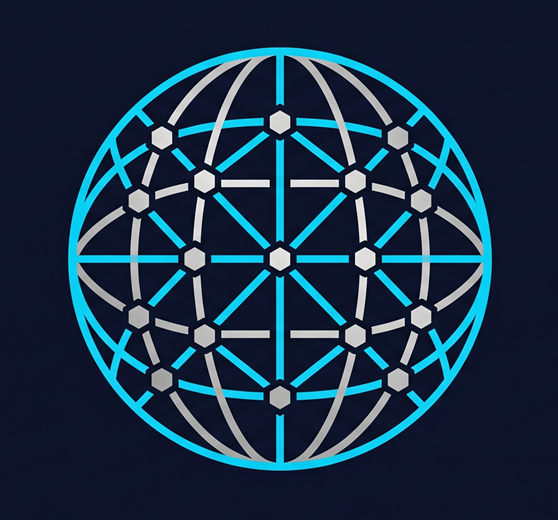

<div align="center">
  
  <h1>🌌 AI Global OS</h1>
  <p><b>The Sovereign Architectural Engine for Autonomous AI Agents.</b></p>

  <p>
    
    
    
    
  </p>
  <p>
    
    
  </p>

  <p><i>A centralized, self-healing operating system that transforms AI from a "code generator" into a <b>Principal Architect</b> — with surgical precision, automated compliance, and zero tolerance for technical debt.</i></p>
</div>

---

## ⚡ Why This Matters: The Sovereign AI Shift

> [!IMPORTANT]
> Standard AI instructions are **ephemeral and generic**. They reset, drift, and forget context. The industry is treating AI as a fancy autocomplete. That approach produces average code at scale.

**This system solves the fundamental problem:** how do you guarantee that every AI response — across every project, every session, every agent — meets the same elite architectural standard?

The answer is **Sovereignty**: a single, version-controlled source of truth that the AI *must* read before executing any task. Not a suggestion. A mandate.

| Without AI Global OS | With AI Global OS |
|---|---|
| AI "forgets" your naming conventions | All conventions are globally enforced |
| AI over-engineers simple features | `Simplicity First` principle + EXAMPLES.md |
| AI misses security patterns (N+1, XSS, raw SQL) | OWASP-driven rules loaded on every task |
| AI makes drive-by refactors when fixing bugs | `Surgical Changes` principle is non-negotiable |
| Tech-stack rules are scattered in chat history | Versioned, per-stack `.md` files auto-loaded |

This is the shift from **AI-as-tool** to **AI-as-collaborator in engineering excellence**.

---

## 🚀 Quick Start: 60-Second Activation

**Step 1 — Clone this repository** to a central location accessible by all your projects:
```bash
git clone https://github.com/m3taz-ahmed/ai-globals.git D:/.ai
```

**Step 2 — Inject the activation directive** into your AI tool's root context file (`.cursorrules`, `GEMINI.md`, `.claude_instructions`, etc.):
```markdown
### 🌍 GLOBAL AI OPERATING SYSTEM
- **Root Path:** `D:/.ai` (adjust to your clone path)
- **Identity & Rules:** Initialize by reading `global-roles.md` and `./rules/` from the root.
- **Master Workflow:** Sync execution cycles using `./workflows/` and `global-workflow.md`.
- **Tech Sync:** Auto-save missing tech-stack rules to `./tech-stack/` and log to `./CHANGELOG.md`.
```

**Step 3 — Send the activation command** to your AI agent:
```
Start immediately by reading your operating protocols from the .ai directory root.
Operate as the Principal 10x Engineer & Chief Architect. Do not rely on prior assumptions.
```

✅ **Your AI is now Sovereign.** The next response you receive will be architecturally enforced.

---

## ⚡ v4.5.0 Milestone: Self-Healing Sovereignty

The system has reached the **Self-Healing** architectural tier — it can now diagnose and repair its own integrity.

- **Self-Healing Validation:** `validate-globals.ps1` v4.5.0 auto-fixes line endings, encoding, and broken cross-references.
- **Contextual Interlocks:** Cross-domain logical rules resolve friction between Performance, Resilience, and Aesthetics.
- **Integrity Guard:** Automated secret scanning and rule propagation hardened to production standard.

<details>
<summary>📋 Previous Milestones</summary>

### v4.4.0 — Deep Structural Integrity
- **Cross-Reference Verification:** Automated detection of broken internal documentation links.
- **Secret Guard:** Real-time entropy scanning to prevent credential leakage.
- **Rule Propagation:** Core rule changes trigger mandatory global re-validation.

### v4.3.0 — Architectural Resilience
- **Incremental Validation:** SHA-256 manifests skip unchanged files for near-instant validation.
- **Audit-Driven Upgrades:** Risk-based upgrade protocol replacing hard pinning.
- **Hardened Execution Loop:** High-fidelity verification patterns in the core workflow.

</details>

---

## 🏛️ System Architecture

```text
.ai/                              # The Sovereign Root
├── global-roles.md               # [Layer 0] Architectural identity & quality gates
├── global-workflow.md            # [Core] Cognitive loading & execution protocol
├── EXAMPLES.md                   # [Reference] ❌ LLM mistakes vs ✅ correct patterns
├── MEMORY.md                     # [ADR] Architectural Decision Records
│
├── rules/                        # Precision-Guided Constraints (12 files)
│   ├── core-behavioral-compact.md  # [Layer 0] 4 non-negotiable principles
│   ├── anti-patterns.md            # [Layer 1] Hard-stop negative constraints
│   ├── principal-architect.md      # [L2] Persona & architectural DNA
│   ├── security-standards.md       # [L2] Zero-Trust, OWASP protocols
│   ├── performance-standards.md    # [L2] N+1 prevention, query budgets
│   ├── api-integration-standards.md # [L2] Circuit breakers, idempotency
│   ├── observability-standards.md  # [L2] Structured logging, audit trails
│   ├── code-quality.md             # [L2] SOLID, DRY, naming conventions
│   ├── git-standards.md            # [L2] Conventional Commits, PR rules
│   ├── saas-standards.md           # [L2] Multi-tenancy, billing core
│   ├── llm-behavioral-guidelines.md # [L2] Expanded self-tests
│   └── environment-windows.md      # [L2] Windows/WSL compatibility
│
├── tech-stack/                   # Domain-Specific RAG (37 files, lazy-loaded)
│   ├── laravel-12.md             # Laravel 12+ Professional Standards
│   ├── laravel-13.md             # [SPECULATIVE] Laravel 13 preview
│   ├── php-8-3.md / php-8-4.md   # PHP type system & property hooks
│   ├── react-ecosystem.md        # React, Next.js, Expo, Vite
│   ├── filament-4.md / filament-5.md # Filament Admin patterns
│   ├── design-foundations.md     # Bento UI & Premium UX Tokens
│   ├── saas-tenancy.md           # stancl/tenancy implementation
│   ├── saas-billing.md           # Stripe/Paddle + MENA billing
│   └── ... (MySQL, Node.js, Tailwind, Vite, Pest, Spatie, Alpine)
│
├── workflows/                    # 9 Execution Protocols (trigger-based)
│   ├── 00-prompt-architecting.md # /prompt trigger — Requirement discovery
│   ├── 01-planning.md            # Architectural gating & strategy
│   ├── 02-execution.md           # Surgical implementation loops
│   ├── 03-debugging.md           # Structured debugging & post-mortem
│   ├── 04-deployment.md          # Deployment, rollback & health checks
│   ├── 05-code-review.md         # Security/performance/quality review
│   ├── 06-maintenance.md         # Full system deep-scan protocol
│   ├── 07-security-audit.md      # Security audit & hardening
│   └── 08-onboarding.md          # AI Architect initialization
│
└── scripts/
    └── validate-globals.ps1      # Self-healing integrity validator
```

---

## 🎯 Key Architectural Pillars

### 1. Layered Context Loading (Zero Waste)
The system uses a **lazy-loading pattern** — the AI only reads what's relevant to the current task:
- **Layer 0 (Always):** Core identity + behavioral compact (~100 lines)
- **Layer 1 (Always):** Anti-patterns — hard-stop constraints
- **Layer 2 (On-Demand):** Security, Performance, API, Observability rules
- **Layer 3 (On-Demand):** Workflow + exact tech-stack files matching the project

### 2. "Wow Factor" Design Mandate
All UI work must bypass the "Banal" and achieve the "Premium":
- **Glassmorphism & Bento Grids** as standard layouts
- **Micro-interactions & Fluid Motion** (Framer Motion / GSAP)
- **Accessibility (WCAG 2.2 AA)** baked into every component

### 3. Zero-Trust Security & Resiliency
- **Surgical API Patterns:** Circuit Breakers, Idempotency, Retry logic
- **Hardened Security:** OWASP-driven validation, automated sanitization
- **Observability:** Structured JSON logging and high-fidelity audit trails

### 4. Self-Healing Validation
```powershell
# Standard run
.\scripts\validate-globals.ps1

# Auto-fix encoding, line endings, and cross-references
.\scripts\validate-globals.ps1 -Fix

# Full scan (bypass incremental SHA-256 cache)
.\scripts\validate-globals.ps1 -Force

# Dry-run (show what -Fix would change)
.\scripts\validate-globals.ps1 -Fix -DryRun
```

---

## 🤝 Contributing

We welcome contributions that raise the standard. Please read:
- [**CONTRIBUTING.md**](CONTRIBUTING.md) — How to contribute tech-stack rules, workflows, and examples
- [**CODE_OF_CONDUCT.md**](CODE_OF_CONDUCT.md) — Community standards
- [**SECURITY.md**](SECURITY.md) — Vulnerability disclosure policy

---

*Engineered with precision by [m3taz-ahmed](https://github.com/m3taz-ahmed). Built for engineers who refuse to settle for mediocre AI output.*
