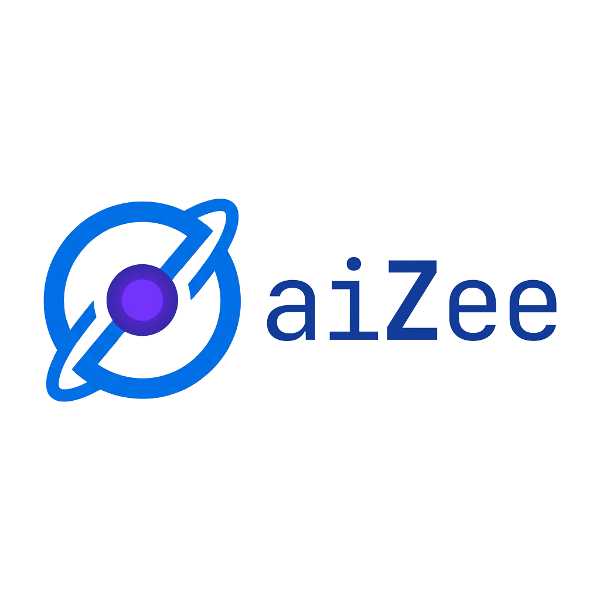

<div align="center">
  
  <h1>AI Global OS</h1>
  <p><strong>Stop letting AI write spaghetti code. Turn it into your Principal Architect.</strong></p>

  <p>
    
    
    
    
  </p>
  <p>
    
    
    
  </p>

  <p><i>A zero-compromise, version-controlled operating system that eliminates AI context drift, enforces bleeding-edge engineering standards, and governs every line of generated code.</i></p>
</div>

---

[Read this in Arabic](README-AR.md)

---

## Table of Contents

1. [Why use AI Global OS?](#why-use-ai-global-os)
2. [What you need before you start](#what-you-need-before-you-start)
3. [Activate in 60 seconds](#activate-in-60-seconds)
4. [The six pillars of AI Global OS](#the-six-pillars-of-ai-global-os)
5. [Dashboard and observability](#dashboard-and-observability)
6. [System architecture](#system-architecture)
7. [For non-programmers: what this means for your team](#for-non-programmers-what-this-means-for-your-team)
8. [Connect the OS to your AI agent](#connect-the-os-to-your-ai-agent)
9. [Global rules to paste into your AI agent IDE](#global-rules-to-paste-into-your-ai-agent-ide)
10. [CLI reference](#cli-reference)
11. [The 19 personas and 13 lord skill domains](#the-19-personas-and-13-lord-skill-domains)
12. [Workflows](#workflows)
13. [Recent highlights and new features](#recent-highlights-and-new-features)
14. [Installer Guide](#installer-guide)
15. [Quality gates and contributing](#quality-gates-and-contributing)
16. [Centralized MCP secrets (.env)](#centralized-mcp-secrets-env)

---

## Why use AI Global OS?

Most teams use AI as a high-speed junior developer. It writes fast, but it hallucinates APIs, forgets naming conventions, ignores N+1 queries, and silently ships technical debt.

**AI Global OS** is a Sovereign Architectural Engine. It forces Cursor, Copilot, Claude, Gemini, Windsurf, Cline, Aider, and GitHub Copilot to read from a centralized, version-controlled source of truth *before* writing a single line of code.

| Without AI Global OS | With AI Global OS |
| :--- | :--- |
| Context drift after a few prompts | Rules and personas hard-loaded every session |
| Deprecated packages and silent tech debt | Exact-version tech-stack locked via live MCP docs |
| Raw SQL, missing XSS filters, weak secrets | OWASP, zero-trust, and RBAC enforced by default |
| Random drive-by refactoring | Surgical changes through policy, budget, and audit gates |
| One-size-fits-all AI answers | The right persona(s) and domain skills for the task |

---

## What you need before you start

| Requirement | Minimum | Recommended |
| :--- | :--- | :--- |
| **Python** | 3.10 | 3.11 or 3.12 |
| **pip** | Latest | Latest |
| **Git** | 2.30+ | Latest |
| **OS** | Windows 10 / macOS 12 / Linux (glibc 2.31+) | Windows 11 / macOS 14 / Ubuntu 22.04+ |

Optional but strongly recommended:

- A compatible AI coding assistant: **Cursor**, **GitHub Copilot**, **Claude Code**, **Windsurf**, **Cline**, **Aider**, or similar.
- **Context7 MCP** for live, version-correct library documentation.
- **graphify** knowledge graph (built from the repo itself, no LLM required).

The core OS is **pure Python**. Node.js is only needed if you extend the dashboard/frontend; the built-in dashboard runs on Python's standard-library HTTP server and SQLite.

---

## Activate in 60 seconds

> Make sure **Python 3.10+** and **Git** are installed. The OS itself is pure Python; Node.js is only needed if you extend the dashboard/frontend.

1. **Clone the central brain** to a fixed location (for example `D:/.ai` or `~/.ai`):
   ```bash
   git clone https://github.com/m3taz-ahmed/ai-globals.git D:/.ai
   ```

2. **Install the OS**:
   ```powershell
   # Windows
   .\install.ps1

   # macOS / Linux
   bash install.sh
   ```
   The installer copies the repo to your OS root, installs the `aios` package with `[dev,graphify]` extras, builds the integrity manifest, and creates the `ai-os` CLI shim.

3. **Install Python dependencies** inside the cloned folder (only needed if you skipped the installer):
   ```bash
   python -m pip install -e '.[graphify]'
   ```
   For development (tests, linting, graph), use `'.[dev,graphify]'`.

4. **Verify the installation**:
   ```bash
   ai-os doctor
   ai-os status
   ```
   `doctor` checks that the OS root, policies, rules, and vector index are healthy. `status` prints the current persona, skill, workflow, and budget counts.

5. **Use the CLI**:
   ```bash
   ai-os persona detect --multi "your task description"
   ai-os check edit
   ai-os run 02-execution
   ai-os memory ingest
   ```

6. **Start the local dashboard** (optional):
   ```bash
   python dashboard/server.py 8080
   ```
   Then open `http://127.0.0.1:8080`. Set `AGENT_OS_DASHBOARD_TOKEN` to require Bearer authentication.

7. **Enable the MCP server**:
   Add `aios_mcp/config.json` to your IDE MCP config, or run:
   ```bash
   python aios_mcp/aios_server.py
   ```

8. **Point your AI agent at the OS rules**:
   See [Connect the OS to your AI agent](#connect-the-os-to-your-ai-agent) for the exact file to load into Cursor, Copilot, Claude, Windsurf, Cline, or Aider.

Your AI is now sovereign. It analyzes every request against SOLID, OWASP, WCAG, and your exact tech stack before generating code.

---

## The six pillars of AI Global OS

AI Global OS is not a prompt library. It is a runtime control plane that sits between you and every AI agent you use.

### 1. Persona + Lord Skill composition

The OS ships with **19 personas** (from `ARCH` to `CV`) and **13 lord-level domain skills**. For every request the OS detects the most relevant persona *set* and loads the matching skill files. You can also spawn agents with multiple personas, e.g. `ARCH + QA + security-lord`.

```bash
ai-os persona detect --multi "build a secure docker API with postgres"
# Returns primary persona, secondary personas, primary skills, and lord skills.
```

This is implemented in `runtime/persona.py` + `runtime/skill_resolver.py` and used by `Kernel`, `WorkflowRunner`, and `AgentPool`.

**New:** skills and rules can declare YAML frontmatter that makes them active only for specific paths, stacks, or persona combinations. The runtime filters skills automatically, so an agent never receives irrelevant guidance.

### 2. Runtime governance

Every action passes through a policy + budget gate before it runs.

- **Policy engine** — `allow/ask/deny` YAML rules with safe AST evaluation.
- **Budget manager** — token/cost/call limits per scope.
- **Audit logger** — every decision is recorded.
- **Workflow runner** — durable SQLite-backed execution with saga support.
- **Saga orchestrator** — compensating actions for long-running operations.
- **Telemetry** — structured events for observability.

**New:** `Kernel.act`, `run_workflow`, `chat_message`, and `run_saga` accept a `fresh_context` parameter. When enabled, the kernel resets the per-session budget and re-derives persona/skill keys so a new chat or workflow cannot inherit stale auto-injected context.

### 3. Live ground-truth, not stale memory

Before implementing any external library or framework, the OS queries Context7 MCP (`resolve-library-id` then `get-library-docs`) so the generated code matches the actual current API. If `graphify-out/graph.json` exists, the OS navigates the knowledge graph instead of blind `grep`.

You can also query these tools from the CLI:

```bash
# List your skills
ai-os skill list

# Read a skill
ai-os skill invoke technical-writer

# Search skills by keyword
ai-os skill search security

# Call an external MCP tool
ai-os mcp context7 resolve-library-id --args '{"library":"fastapi"}'
```

### 4. Memory you can trust

The memory service uses SQLite + FTS5 plus optional vector indexing. It stores episodic, semantic, factual, and procedural context. After every rule, tech-stack, or workflow change, `ai-os memory ingest` refreshes the index.

```bash
ai-os memory ingest
ai-os memory search "docker deployment"
ai-os query "auth pattern"
```

### 5. Engineering standards enforced by code

Quality is not optional. The built-in CI pipeline and `python eval/harness.py` run:

- `ruff check .` for lint.
- `mypy` for strict typing.
- `pytest -q` for tests.
- `scripts/validate-globals.py --fix` for integrity.

The OS forbids raw SQL interpolation, `any` type abuse, inline imports, wildcard CORS, and unvalidated destructive actions.

### 6. Token efficiency (negligible context cost)

The OS is designed to add as few tokens as possible to the AI context window — **you do not need to type any special flags**. The defaults already keep the context small:

- **Persona detection is local** — pure Python string scoring, no LLM call, zero tokens.
- **Only skill names are returned by default** — the runtime does not dump every skill file into the prompt.
- **Tight limits by default**: 1 primary persona skill + up to `max_personas - 1` secondary skills + up to `max_lords` (default **5**) lord skills.
- The flags below are only for power users or CI scripts that want to cap context explicitly:

  ```bash
  # Keep it tiny (single persona, no lords)
  ai-os persona detect --multi "deploy docker" --max-personas 1 --max-lords 0 --single

  # Allow a small panel
  ai-os persona detect --multi "..." --max-personas 2 --max-lords 3
  ```

- `Kernel.act`, `WorkflowRunner`, and `AgentPool` all respect these limits, so an agent spawned with `ARCH + QA + security-lord` only loads the files that are actually relevant.

---

## Dashboard and observability

The AI Global OS dashboard is a dark-first, command-center-style web UI for monitoring and operating the OS. It is not a marketing page; it is an operational cockpit where you can see personas, runtime state, budget, memory, skills, graphify, and telemetry in one place.

Key features (defined in `DESIGN.md`):

- **Command palette** — press `Cmd/Ctrl + K` to open a global command palette.
- **Bento-grid metric cards** — active sessions, tokens used, memory hit rate, graphify nodes, pending skills, last audit.
- **Status pills** — green for allowed/completed, amber for warnings, red for blocked/denied.
- **Glass panels** and a deep lapis-charcoal color system with cyan (AI state), violet (knowledge), and lime (success) accents.
- **Security** — configurable CORS allow-list, CSRF header checks, request-size limits, and optional `AGENT_OS_DASHBOARD_TOKEN` Bearer auth.

Start it with:

```bash
python dashboard/server.py 8080
```

---

## System architecture

```text
.ai/                              # Sovereign root
├── AGENTS.md                     # Cross-tool canonical instruction
├── global-roles.md               # [Layer 0] Personas and identity
├── global-roles-ar.md            # [Layer 0] Arabic persona charter
├── global-workflow.md            # [Core] Cognitive loading & execution protocol
├── README.md                     # Human front door (this file)
├── README-AR.md                  # Arabic front door
├── Memory.md                     # Short-term cross-session context
├── CHANGELOG.md                 # Release notes
│
├── .cursor/rules/                # Cursor rule adapters
├── .claude/                      # Claude Code config, skills, agents
├── .clinerules/                  # Cline rules
├── .windsurfrules                # Windsurf rules
├── .aider.conf.yml               # Aider config
├── .github/copilot-instructions.md # GitHub Copilot instructions
├── .devin/skills/global-os/      # Devin skill adapter
├── .windsurf/skills/global-os/   # Windsurf skill adapter
│
├── rules/                        # Compressed behavioral & structural rules
├── tech-stack/                   # Compressed domain-specific RAG tech-stacks
├── workflows/                    # Compressed trigger-based execution protocols
├── skills/                       # Persona + lord skill files
│
├── state/                        # Logs & persistent state
├── brain/                        # Memory database
├── graphify-out/                 # Knowledge graph
│
├── runtime/                      # Runtime kernel (policy, budget, workflow, chat, telemetry)
├── memory/                       # Memory service
├── aios_mcp/                     # MCP server
├── dashboard/                    # Web dashboard
├── cli.py                        # CLI entry point
├── config.py                     # Root discovery
├── install.ps1 / install.sh      # OS installer
├── plugins.yaml                  # Plugin manifest
├── pyproject.toml                # Package metadata
├── .env                          # MCP secrets (git-ignored, never committed)
├── .env.example                  # MCP secrets template (safe to commit)
└── scripts/                      # Self-healing operations
    ├── validate-globals.py       # Integrity validator
    ├── sync-agent-configs.py     # Sync configs across tools
    ├── graphify_mcp_wrapper.py   # Graphify MCP bridge
    ├── aios_mcp_wrapper.py       # AIOS MCP server wrapper
    ├── mcp_secrets_loader.py     # Centralized .env secrets loader
    └── mcp_env_wrapper.py        # Generic env-loading MCP wrapper
```

---

## For non-programmers: what this means for your team

**The short version:** AI Global OS turns chaotic AI-assisted coding into a disciplined, repeatable process that protects quality and reduces risk.

- **No more "the AI forgot what we agreed on."** Every session reloads the same rules, standards, and project context.
- **No more guessing if the code is safe.** Security, performance, and compliance checks are built in, not optional.
- **No more one AI personality for everything.** The OS chooses the right expert — or team of experts — for the job, whether that is an architect, a security auditor, a data engineer, or a technical writer.
- **No more silent technical debt.** Every change is audited, budgeted, and validated before it is accepted.
- **It works with the tools you already use.** Cursor, Copilot, Claude, Gemini, Windsurf, Cline, Aider, and GitHub Copilot all read the same rulebook.

Think of AI Global OS as the "policy and training layer" that makes every AI assistant behave like a senior member of your engineering team.

---

## Connect the OS to your AI agent

After cloning, tell your AI coding tool to read the OS rules. Each tool has its own adapter file:

| AI tool | File to load / copy into project instructions |
| :--- | :--- |
| **Cursor** | `.cursor/rules/ai-global-os.mdc` |
| **Claude Code / Claude projects** | `.claude/CLAUDE.md` |
| **Windsurf** | `.windsurfrules` (auto-loaded if in project root) |
| **Cline** | `.clinerules/ai-global-os.md` |
| **Aider** | `.aider.conf.yml` |
| **GitHub Copilot (in-repo)** | `.github/copilot-instructions.md` |
| **Devin** | `.devin/skills/global-os/SKILL.md` |
| **Any other agent** | Load `AGENTS.md` + `global-roles.md` + `global-workflow.md` into the system prompt / project instructions. |

> **See [`docs/BOOTLOADER.md`](docs/BOOTLOADER.md)** for the full boot sequence diagram and how the global bootloader works.

### MCP servers

The installer configures 7 MCP servers in `.claude/settings.json` and `.devin/mcp_config.json`:

| MCP server | Command | Purpose | Requires |
| :--- | :--- | :--- | :--- |
| `ai-global-os` | `python -m aios_mcp.aios_server` | Core OS tools: `query_rules`, `check_policy`, `search_memory`, `search_memory_vector`, `search_skills`, `get_changelog`, `get_active_context` | Python |
| `graphify` | `python scripts/graphify_mcp_wrapper.py` | Codebase knowledge graph queries | Python + graphify |
| `context7` | `npx -y @upstash/context7-mcp` | External library documentation | npx (Node.js) |
| `upwork` | `npx -y @furkankoykiran/upwork-mcp` | Upwork job search + proposals | npx + OAuth |
| `freelancer` | `npx -y freelancer-mcp-server` | Freelancer project search + bidding | npx + OAuth |
| `fiverr` | `uvx fiverr-mcp-server` | Fiverr gig search (read-only) | uvx (uv) |
| `linkedin` | `octopus-linkedin-mcp` | LinkedIn content automation: draft→approve→publish, analytics, comments | Python + OAuth token |

### MCP server setup guide

Each MCP server needs a one-time setup. Follow the steps for each server you want to use.

#### 1. `ai-global-os` (core — no setup needed)

This is the built-in OS server. It starts automatically when you run the installer.

```powershell
# Verify it works
ai-os status
```

**Requires:** Python 3.10+ (already installed).

---

#### 2. `graphify` (codebase knowledge graph — no setup needed)

This is the built-in graphify server. It starts automatically after `graphify update .`.

```powershell
# Build the graph
ai-os graphify

# Query it
ai-os mcp graphify query "where is auth handled?"
```

**Requires:** Python + graphify (installed by the installer).

---

#### 3. `context7` (external library docs)

Context7 provides up-to-date documentation for any library/framework.

**Step 1: Install Node.js**

```powershell
# Check if Node.js is installed
node --version

# If not installed, download from https://nodejs.org/ (LTS version)
# After install, verify:
node --version   # should print v20+ 
npx --version    # should print 10+
```

**Step 2: Test it**

```powershell
ai-os mcp context7 resolve-library-id --args '{"library":"fastapi"}'
```

**Requires:** Node.js 18+ (includes npx). No OAuth needed.

---

#### 4. `upwork` (job search + proposals)

Upwork MCP lets you search jobs, get profile, list contracts, and save jobs.

**Step 1: Install Node.js** (same as context7 above)

**Step 2: Create Upwork API app**

1. Go to https://www.upwork.com/developer/applications
2. Click "Create app"
3. Fill in:
   - **App name**: `AI Global OS`
   - **App type**: `Client`
   - **Redirect URI**: `http://localhost:8080/callback`
4. Save and copy:
   - **Client ID**
   - **Client Secret**

**Step 3: Add credentials to `.env`**

Edit `D:\.ai\.env` (copy from `.env.example` if it doesn't exist):

```env
UPWORK_CLIENT_ID=your_client_id
UPWORK_CLIENT_SECRET=your_client_secret
```

> **Why `.env`?** All MCP secrets are centralized in one git-ignored file. See [Centralized MCP secrets](#centralized-mcp-secrets-env) for details.

**Step 4: Authenticate**

```powershell
npx -y @furkankoykiran/upwork-mcp auth
```

This opens a browser → log in to Upwork → approve → token is cached.

**Step 5: Test it**

```powershell
ai-os mcp upwork search_jobs --args '{"query":"laravel","limit":5}'
```

**Requires:** Node.js 18+, Upwork account, Upwork Developer app.

---

#### 5. `freelancer` (project search + bidding)

Freelancer MCP lets you search projects, place bids, and send messages.

**Step 1: Install Node.js** (same as context7 above)

**Step 2: Get Freelancer OAuth token**

1. Go to https://developers.freelancer.com/
2. Create an app
3. Follow the OAuth flow to get an access token
4. Copy the **OAuth token**

**Step 3: Add token to `.env`**

Edit `D:\.ai\.env` (copy from `.env.example` if it doesn't exist):

```env
FREELANCER_OAUTH_TOKEN=your_token
```

> **Why `.env`?** All MCP secrets are centralized in one git-ignored file. See [Centralized MCP secrets](#centralized-mcp-secrets-env) for details.

**Step 4: Test it**

```powershell
ai-os mcp freelancer freelancer_search_projects --args '{"query":"web development","limit":5}'
```

**Requires:** Node.js 18+, Freelancer account, Freelancer Developer app.

---

#### 6. `fiverr` (gig search — read-only)

Fiverr MCP lets you search gigs, get gig details, seller profiles, and reviews.

**Step 1: Install uv**

```powershell
# Windows
pip install uv

# Linux/macOS
pip install uv
# or: curl -LsSf https://astral.sh/uv/install.sh | sh
```

**Step 2: Verify uvx works**

```powershell
uvx --version
```

**Step 3: Test it**

```powershell
ai-os mcp fiverr fiverr_search_gigs --args '{"query":"logo design","limit":5}'
```

**Requires:** Python + uv (installs uvx). No OAuth needed (read-only).

---

#### 7. `linkedin` (content automation — governed)

LinkedIn MCP lets you draft, approve, publish, schedule, and analyze posts.

> **Important:** Each user creates their **own** LinkedIn Developer App. This is required by LinkedIn's API policy — the app is a container for API permissions, and the access token is tied to your personal LinkedIn account. You cannot share one app across users (each user generates their own token via their own app).

**Step 1: Create a LinkedIn Page** (required for API app)

1. Go to https://www.linkedin.com/company/setup/new/
2. Fill in:
   - **Page name**: `AI Global OS` (or your brand name)
   - **Website**: `https://github.com/your-username/your-repo`
   - **Industry**: `Software` or `IT Services`
   - **Company type**: `Small business`
3. Click **Create page**

**Step 2: Create a LinkedIn Developer App**

1. Go to https://www.linkedin.com/developers/apps/new
2. Fill in:
   - **App name**: `AI Global OS`
   - **LinkedIn Page**: select the page you created
   - **App logo**: upload any image
   - **Legal page URL**: your website or GitHub URL
   - **Privacy policy URL**: your website or GitHub URL
3. Click **Create app**
4. Copy the **Client ID** and **Client Secret** (from the App details page)

**Step 3: Enable API products**

In your app, go to **Products** tab and click **Request access** for:

- ✅ **Share on LinkedIn** (for publishing posts)
- ✅ **Sign In with LinkedIn using OpenID Connect** (for profile access)
- ✅ **Community Management API** (for Page management + analytics)

**Step 4: Set redirect URLs**

1. Go to **Auth** tab
2. Under **Authorized redirect URLs**, add:
   ```
   http://localhost:8000/callback
   http://localhost:8080/callback
   ```
3. Click **Save**

**Step 5: Install octopus-linkedin**

```powershell
pip install octopus-linkedin
```

**Step 6: Generate access token**

Use LinkedIn's Token Generator (easiest method):

1. Go to https://www.linkedin.com/developers/tools/oauth/token-generator
2. Select your app (`AI Global OS`)
3. Select scopes: `r_liteprofile`, `w_member_social`, `r_member_social`
4. Click **Generate token**
5. Log in to LinkedIn → click **Allow**
6. Copy the **Access Token** (valid for ~60 days)

**Step 7: Save the token**

Add the token to `.env` (copy from `.env.example` if it doesn't exist):

```env
LINKEDIN_ACCESS_TOKEN=your_token_here
```

Alternatively, save the token to the octopus-linkedin cache path:

```powershell
# Find the token path
python -c "import linkedin.auth; print(linkedin.auth.TOKEN_PATH)"

# Save token to that path (replace YOUR_TOKEN)
$token = "YOUR_TOKEN"
$expires = [DateTimeOffset]::Now.AddDays(60).ToUnixTimeSeconds()
$json = @{access_token=$token; obtained_at=[DateTimeOffset]::Now.ToUnixTimeSeconds(); expires_at=$expires} | ConvertTo-Json
$tokenPath = (python -c "import linkedin.auth; print(linkedin.auth.TOKEN_PATH)") -replace "/", "\"
Set-Content -Path $tokenPath -Value $json

# Linux/macOS:
# TOKEN_PATH=$(python -c "import linkedin.auth; print(linkedin.auth.TOKEN_PATH)")
# echo "{\"access_token\":\"YOUR_TOKEN\",\"obtained_at\":$(date +%s),\"expires_at\":$(($(date +%s)+5184000))}" > "$TOKEN_PATH"
```

> **Why `.env`?** All MCP secrets are centralized in one git-ignored file. See [Centralized MCP secrets](#centralized-mcp-secrets-env) for details.

**Step 8: Test it**

```powershell
# Get your profile
ai-os linkedin profile

# Or via MCP directly
ai-os mcp linkedin get_profile --args '{}'

# Publish a test post (visible to connections only)
ai-os linkedin post "Testing AI Global OS + LinkedIn integration!" --visibility CONNECTIONS

# Use the governed draft workflow
ai-os linkedin draft "My first governed draft post"
ai-os linkedin drafts
ai-os linkedin approve drft_xxx
ai-os linkedin publish drft_xxx

# Schedule for later
ai-os linkedin schedule drft_xxx 2026-08-20T09:00:00Z

# Get post stats
ai-os linkedin stats urn:li:share:123
```

**Token renewal:** LinkedIn tokens expire after ~60 days. When that happens:
1. Go back to the [Token Generator](https://www.linkedin.com/developers/tools/oauth/token-generator)
2. Generate a new token
3. Repeat Step 7 above

**Security:**
- The token is stored in `site-packages/token.json` (local only)
- `.gitignore` blocks `token.json`, `*.token`, `*.secret`, `credentials.json`
- No credentials are ever committed to the repository
- The governed workflow (`draft → approve → publish`) ensures no content goes live without explicit approval

**Requires:** Python 3.10+, LinkedIn account, LinkedIn Developer app, LinkedIn Page.

---

### MCP troubleshooting

| Problem | Solution |
| :--- | :--- |
| `npx: not found` | Install Node.js 18+ from https://nodejs.org/ |
| `uvx: not found` | Run `pip install uv` |
| `octopus-linkedin: not found` | Run `pip install octopus-linkedin` and use the full path from `where.exe octopus-linkedin` |
| `No token found` (LinkedIn) | Run the token setup steps above, or check `linkedin.auth.TOKEN_PATH` |
| `LinkedIn login fails in browser` | Use the [Token Generator](https://www.linkedin.com/developers/tools/oauth/token-generator) instead of `octopus-linkedin authorize` |
| `Upwork auth fails` | Verify `UPWORK_CLIENT_ID` and `UPWORK_CLIENT_SECRET` env vars are set |
| `MCP server not configured` | Run the installer: `.\install.ps1` (Windows) or `./install.sh` (Linux/macOS) |
| `context7 returns empty` | Check internet connection; Context7 fetches docs live |
| `Token expired` (LinkedIn) | Re-generate via Token Generator; tokens last ~60 days |

### Centralized MCP secrets (`.env`)

All MCP server credentials are managed in a **single `.env` file** at the OS root. This keeps secrets out of the repository (`.env` is git-ignored) while making them available to every MCP server and plugin transparently.

#### How it works

```
D:\.ai\
├── .env                  ← Your real secrets (git-ignored, NEVER committed)
├── .env.example          ← Template with placeholder values (committed)
├── scripts/
│   ├── mcp_secrets_loader.py    ← Loads .env into os.environ at startup
│   └── mcp_env_wrapper.py       ← Generic wrapper: loads .env then execs MCP command
└── .devin/mcp_config.json       ← MCP config (uses wrapper for secret-dependent servers)
```

When an MCP server starts, the wrapper reads `.env`, injects all variables into the environment, then launches the real MCP command. Placeholder values (starting with `your_` and ending with `_here`) are skipped automatically.

#### Setup

1. **Copy the template:**
   ```powershell
   Copy-Item .env.example .env
   ```

2. **Edit `.env`** and fill in your real credentials:
   ```env
   # LinkedIn
   LINKEDIN_ACCESS_TOKEN=your_real_token_here

   # Upwork
   UPWORK_CLIENT_ID=your_real_client_id
   UPWORK_CLIENT_SECRET=your_real_client_secret

   # Freelancer
   FREELANCER_OAUTH_TOKEN=your_real_oauth_token
   ```

3. **Verify secrets are loaded:**
   ```powershell
   python scripts/mcp_secrets_loader.py --check
   ```
   Output:
   ```
   [mcp-secrets] Loaded from: D:\.ai\.env
   [mcp-secrets] Injected 3 var(s): LINKEDIN_ACCESS_TOKEN, UPWORK_CLIENT_ID, UPWORK_CLIENT_SECRET
   [mcp-secrets] All required vars present.
   ```

#### Security

- `.env` is in `.gitignore` (line 13) — it will **never** be committed
- `.env.example` uses placeholder values only — safe to commit
- The loader skips any value matching the `your_*_here` placeholder pattern
- `runtime/mcp_client.py` also loads `.env` before spawning any MCP server process
- All AIOS plugins (`plugins/linkedin`, `plugins/upwork`, `plugins/freelancer`) inherit the loaded environment automatically

#### Required secrets per server

| MCP server | Required env vars | How to get them |
| :--- | :--- | :--- |
| `linkedin` | `LINKEDIN_ACCESS_TOKEN` | [LinkedIn Token Generator](https://www.linkedin.com/developers/tools/oauth/token-generator) |
| `upwork` | `UPWORK_CLIENT_ID`, `UPWORK_CLIENT_SECRET` | [Upwork Developer Apps](https://www.upwork.com/developer/applications) |
| `freelancer` | `FREELANCER_OAUTH_TOKEN` | [Freelancer API Settings](https://www.freelancer.com/settings/api) |
| `fiverr` | *(none)* | No secrets needed — only requires `uvx` installed |
| `context7` | *(none)* | No secrets needed |
| `ai-global-os` | *(none)* | No secrets needed |
| `graphify` | *(none)* | No secrets needed |

#### Global MCP config (works in any workspace)

By default, MCP servers are only available when you open the `D:\.ai` project itself. To make all 7 MCP servers available in **any** project — regardless of which IDE you use (Devin, VSCode, Cursor, Antigravity) — run:

```bash
ai-os mcp sync
```

This writes a global `mcp_config.json` with **absolute paths** to:
- **Windows:** `%APPDATA%\devin\mcp_config.json`
- **Linux/macOS:** `~/.config/devin/mcp_config.json`

The installer runs this automatically. After syncing, MCP servers work from any workspace — no per-project setup needed.

```bash
# Preview the config without writing
ai-os mcp sync --check

# Re-sync after adding new MCP servers or changing the OS root
ai-os mcp sync
```

---

The fastest generic setup is to point the agent at:

```text
AGENTS.md
global-roles.md
global-workflow.md
```

These three files give the agent the identity, rules, and execution protocol. The `skills/` and `tech-stack/` files are loaded on demand by the runtime, so they are not copied into the prompt window by hand.

---

## Global rules to paste into your AI agent IDE

If your IDE has a **global / user-level rules** or **system instructions** field (Cursor *User Rules*, Windsurf *Global Rules*, Claude *Project Instructions*, etc.), paste the block below. It teaches every AI session how to boot from AI Global OS.

```text
You are an AI Global OS agent. The OS root is discovered from the `AGENT_OS_ROOT` environment variable or the install directory (no hardcoded path — the installer sets it automatically).

MUST on every session:

1. Cold start: read `global-roles.md` then `global-workflow.md` from the OS root. NEVER trust cached context.
2. Detect the user's persona:
   - For single-domain tasks: `ai-os persona detect "<user prompt>"`.
   - For multi-domain tasks: `ai-os persona detect --multi "<user prompt>"`.
   - Adopt the returned persona(s) and primary skill(s) for the whole session.
3. If the current project has a `spec.md`, read it before any action.

MUST before loading context:

4. Lazy context layers (do not dump all files at once):
   - L0: `rules/core-behavioral-compact.md` + `skills/<primary-skill>/SKILL.md` + any lord skills returned by persona detection.
   - L1: `rules/vocabulary.md`, `rules/anti-patterns.md`, `tech-stack/useful-repos.md`.
   - L2: matched `rules/*.md` + `tech-stack/<pkg>-<ver>.md`.
   - L3: `workflows/<id>.md` for the current task.
5. VersionGate: before loading any `tech-stack/` file, read `composer.lock`, `package-lock.json`, `composer.json`, or `package.json` and load only the matching version.
6. Before implementing any external library/framework, query Context7 MCP (`resolve-library-id` then `get-library-docs`). Never rely on memory.
7. If `graphify-out/graph.json` exists, use `graphify query` or MCP `query_graph` instead of raw grep.

MUST for execution:

8. Route every tool/action through `runtime/kernel.py`: use `ai-os check <action> --args` or `Kernel.act`. No destructive action without explicit user approval.
9. Check `runtime/budget` before every LLM call. Stop on hard cap.
10. Prefer the native MCP server (`aios_mcp/aios_server.py`) for `query_rules`, `check_policy`, `search_memory`, and `search_memory_vector`.

MUST for quality:

11. Run `ruff check .`, `mypy`, `ai-os test --full` (or `pytest -q`), and `python eval/harness.py` before declaring done.
12. After changing `rules/`, `tech-stack/`, `workflows/`, or `skills/`, run `ai-os memory ingest` and `graphify update .`.
13. Git: conventional commits, atomic, never `git add .` (`[GIT-06]`) or force push, stage only files you modified.
```

For **project-level** rules, use the adapter files in the table above instead.

---

## CLI reference

The `ai-os` command is the primary interface to the OS. All commands support `--root` and `--project` to override the discovered OS and project roots.

| Command | Purpose | Example |
| :--- | :--- | :--- |
| `status` | Show OS root, persona, skill, workflow, budget, and rule counts. | `ai-os status` |
| `doctor` | Check that the environment is healthy. | `ai-os doctor` |
| `version` | Print the OS version. | `ai-os version` |
| `sync` | Sync agent configs across tools. | `ai-os sync` |
| `persona detect` | Detect the best persona(s) for a task. | `ai-os persona detect --multi "secure API"` |
| `persona list` | List all personas. | `ai-os persona list` |
| `skill list` | List available skills. | `ai-os skill list` |
| `skill invoke` | Display a skill's markdown content. | `ai-os skill invoke database-lord` |
| `skill search` | Search skills by keyword. | `ai-os skill search mariadb` |
| `check` | Ask the policy engine if an action is allowed. | `ai-os check edit --args '{"file":"x.py"}'` |
| `policy test` | Dry-run a policy decision. | `ai-os policy test edit --args '{"file":"x.py"}'` |
| `run` | Execute a durable markdown workflow. | `ai-os run 02-execution` |
| `saga` | Run a saga with compensations. | `ai-os saga my-saga --steps '[...]'` |
| `query` | Hybrid search across memory. | `ai-os query "auth pattern"` |
| `memory search` | Search memory by kind. | `ai-os memory search "docker"` |
| `memory ingest` | Re-ingest rules, skills, and workflows. | `ai-os memory ingest` |
| `budget list` | Show configured budgets. | `ai-os budget list` |
| `budget set` | Update a budget. | `ai-os budget set --scope global --max-tokens 100000` |
| `project init` | Scaffold a new project with OS structure. | `ai-os project init --path ./my-project` |
| `agent spawn` | Spawn a sub-agent with a persona. | `ai-os agent spawn --persona ARCH,QA --agent-id worker-1` |
| `agent list` | List active agents. | `ai-os agent list` |
| `chat` | Persistent chat REPL or one-shot message. | `ai-os chat "hello"` |
| `ci` | Run the built-in CI quality gates. | `ai-os ci` |
| `test` | Run tests (fast tier ~10s, or `--full` for all tests with coverage ~20s). | `ai-os test` or `ai-os test --full` |
| `stack detect` | Detect the tech stack of the current project. | `ai-os stack detect` |
| `stack show` | Show loaded tech-stack docs. | `ai-os stack show` |
| `mcp` | Call an external MCP tool. | `ai-os mcp context7 resolve-library-id --args '{"library":"fastapi"}'` |
| `telemetry summary` | Show telemetry summary. | `ai-os telemetry summary` |
| `graphify` | Rebuild the knowledge graph. | `ai-os graphify` |
| `linkedin` | LinkedIn content automation. | `ai-os linkedin profile` |
| `linkedin post` | Publish a text post directly. | `ai-os linkedin post "Hello, world!" --visibility PUBLIC` |
| `linkedin draft` | Save a draft locally. | `ai-os linkedin draft "A post to review later"` |
| `linkedin drafts` | List drafts by status. | `ai-os linkedin drafts --status approved` |
| `linkedin approve` | Approve a draft for publishing. | `ai-os linkedin approve drft_abc123` |
| `linkedin publish` | Publish an approved draft. | `ai-os linkedin publish drft_abc123` |
| `linkedin schedule` | Schedule an approved draft. | `ai-os linkedin schedule drft_abc123 2026-07-02T09:00:00Z` |
| `linkedin stats` | Get post stats (likes, comments). | `ai-os linkedin stats urn:li:share:123` |
| `linkedin delete` | Delete a post by URN. | `ai-os linkedin delete urn:li:share:123` |

Run `ai-os --help` for the full list and `ai-os <command> --help` for command-specific options.

---

## The 19 personas and 13 lord skill domains

Personas shape **who** the AI acts like. Lord skills add **deep domain knowledge** on demand.

| Persona | Focus | Primary skill |
| :--- | :--- | :--- |
| **ARCH** | Chief architect, system design, rapid prototyping | `ai-agents-architect` |
| **QA** | Testing, coverage, edge cases, regression hunting | `qa-debugger` |
| **UX** | UI/UX, design systems, accessibility, motion | `frontend-ui-expert` |
| **DEV** | Master developer, backend, APIs, clean code | `backend-api-expert` |
| **SRE** | Reliability, observability, chaos engineering, cloud | `sre` |
| **SEC** | Security, zero-trust, Linux kernel, audits | `security-auditor` |
| **GAME** | 60 FPS game loops, rendering, cross-platform | `game-architect` |
| **PLAY** | Google Play, Android publishing, IAP, ASO | `google-play-warlord` |
| **MOBILE** | Mobile games/apps, Fastlane, anti-cheat | `mobile-game-producer` |
| **DATA** | ETL, data modeling, databases, pipelines | `data-engineer` |
| **ML** | Machine learning, LLMs, inference, MLOps | `ml-engineer` |
| **DEVOPS** | CI/CD, containers, GitOps, release automation | `devops-engineer` |
| **API** | API design, REST/GraphQL, microservices, integrations | `api-architect` |
| **LEGAL** | Privacy, compliance, licensing, audits | `legal-compliance` |
| **PRODUCT** | Requirements, roadmaps, prioritization, metrics | `product-manager` |
| **DOC** | READMEs, API docs, runbooks, changelogs | `technical-writer` |
| **PERF** | Latency, throughput, profiling, optimization | `performance-engineer` |
| **PROPOSAL** | Proposals, bids, Arabic/English client copy | `proposal-writer` |
| **CV** | ATS-optimized resumes, LinkedIn, cover letters | `cv-writer` |

Lord skill domains: `database-lord`, `mariadb-lord`, `ai-ml-lord`, `devops-lord`, `cloud-platforms-lord`, `frontend-frameworks-lord`, `backend-frameworks-lord`, `page-sections-lord`, `language-lord`, `linux-systems-lord`, `messaging-streaming-lord`, `search-vector-lord`, `security-lord`.

When a prompt touches multiple domains, the OS composes a panel — for example `DEV + API + security-lord` — and loads the union of relevant skill files.

---

## Workflows

Workflows are durable, markdown-driven execution protocols stored in `workflows/`. They are backed by SQLite, support checkpoints, and can be triggered from the CLI or by the agent.

Core execution workflows:

| ID | Purpose |
| :--- | :--- |
| `00-prompt-architecting` | Refine and architect a user prompt. |
| `01-planning` | Plan a feature or task end-to-end. |
| `02-execution` | Execute a planned task. |
| `03-debugging` | Debug a failing system. |
| `04-deployment` | Deploy to production safely. |
| `05-code-review` | Review code against standards. |
| `06-maintenance` | Run recurring maintenance. |
| `07-security-audit` | Audit for security issues. |
| `08-onboarding` | Onboard a new project or developer. |
| `09-discovery` | Explore an unfamiliar codebase. |
| `10-saga-reconciliation` | Reconcile a failed saga. |
| `11-audit-core` | Core audit checklist. |
| `12-audit-ui` | UI/UX audit checklist. |
| `13-audit-perf` | Performance audit checklist. |
| `14-ponytail-review` | Technical-debt review. |
| `15-page-builder-setup` | Scaffold a section-based page builder. |
| `16-cleanup-and-scm` | Clean up and stage changes. |
| `17-memory-sync` | Sync memory after a milestone. |

Run any workflow with:

```bash
ai-os run 02-execution
```

---

## Recent highlights and new features

### v4.22.0

- **19 personas and 73 specialized skills**, including the new `PROPOSAL` and `CV` personas, and **29 durable workflows**.
- **Multi-persona + lord skill composition** via `PersonaDetector.detect_multiple`, `SkillResolver`, and `Kernel`/`WorkflowRunner`/`AgentPool` integration.
- **Externalized persona definitions** in `runtime/personas.yaml` so persona wiring can be updated without touching code.
- **Clean Architecture refactor** of the persona/skill subsystem with dependency injection.
- Runtime governance: policy, budget, audit, workflow, saga, telemetry, memory, and MCP server.
- CI pipeline with `ruff`, `mypy`, `pytest`, `validate-globals`, and `eval/harness.py`.

### Latest additions

- **Professional installer suite** — `install.ps1` (Windows), `install.sh` (Linux/macOS), and `installer/gui_installer.ps1` (WPF GUI wizard). Hybrid root detection, pre-flight checks, migration system, retry logic, logging, rollback, auto-detect moved repos, checksum verification, and MCP health checks.
- **WPF GUI installer** — 8-page wizard with dark theme, 24 component checkboxes, live progress log, and silent mode. Launch with `.\install.ps1 -Gui`.
- **Migration engine** (`scripts/migrate.py`) — Version-aware migrations with `.aios-version` tracking, dry-run support, and ordered chain building.
- **5 new MCP servers** — Upwork, Freelancer, Fiverr, Context7, LinkedIn integrated as AIOS plugins and MCP config entries. Total tools: 75 (up from 2).
- **LinkedIn integration** — `octopus-linkedin` MCP server with governed draft→approve→publish workflow, 18 plugin tools, profile optimization, content scheduling, and post analytics. CLI: `ai-os linkedin post/draft/approve/publish/stats`.
- **4 new AIOS plugins** — `plugins/upwork`, `plugins/freelancer`, `plugins/fiverr`, `plugins/context7` acting as MCP proxies.
- **Dashboard graphify visualization** — `/api/graph`, `/api/graph/stats`, `/api/events` endpoints + SSE event stream.
- **3 new MCP tools** — `search_skills`, `get_changelog`, `get_active_context` in `aios_mcp/aios_server.py`.
- **`tech_stack` Python support** — `pyproject.toml` parser + Python package aliases in `runtime/tech_stack.py`.
- **`check_policy` read permissions** — `default.yaml` policy now explicitly allows `read`, `exec`, `check_policy`, `search`, `query` actions.
- **Stub adapters documented** — `CodexAdapter`, `ClaudeCodeAdapter`, `RemoteA2AAdapter` in `aios_mcp/adapters.py` marked as stubs.
- **`state/MEMORY.md` references fixed** — All 21 references updated to point to `Memory.md` in root.
- **Comprehensive project review** captured in `.ai/review-findings.md` with P0–P5 issues, SWOT, and development ideas.
- **29 durable workflows** (up from 27), including new `18-data-migration` and `19-incident-response`, with `[TRIGGER]` tags and manifest-based routing.
- **Plugin AST sandbox** in `runtime/plugin.py` blocks denylisted modules and dangerous calls (`eval`, `exec`, `open`, etc.) before `exec_module`.
- **Dashboard hardening** — CSP, X-Frame-Options, X-Content-Type-Options, Referrer-Policy, XSS escaping, SRI for Chart.js, and lazy token generation.
- **MCP client hardening** — per-key `_SEND_LOCKS` and `_send` timeout to prevent process races.
- **SQLite WAL + busy timeout + locks** in `memory/store.py`, `runtime/workflow.py`, and `runtime/saga.py`.
- **Budget `_dirty` flag** in `runtime/budget.py` to avoid unnecessary disk writes.
- **Pydantic-specific validation** in `runtime/kernel.py` instead of broad `except Exception`.
- **Audit redaction** for tokens, keys, secrets, and credentials in `runtime/audit.py`.
- **`.ai/repos-study.md`** — standalone file with an English agent meta-prompt and 30+ curated GitHub repos to evaluate.
- **DevOps / security** — `.github/dependabot.yml`, `CODEOWNERS`, `security.yml` (`pip-audit` + `bandit`), and `bandit`/`pip-audit` in `pyproject.toml` dev dependencies.
- **Conditional rules with YAML frontmatter** (`runtime/rule_frontmatter.py` + `runtime/skill_resolver.py`). Skill and rule files can declare `paths`, `stack`, and `personas` filters. The runtime only loads skills that match the current context, and the MCP `query_rules` endpoint returns active rules only.
- **Fresh-context boundary** (`runtime/kernel.py` + `runtime/budget.py`). A `fresh_context` flag resets per-session budgets and re-derives auto-injected persona/skill keys for clean chat sessions, workflows, and sagas.
- **`ai-os skill` CLI** (`list`, `invoke`, `search`) backed by `SkillResolver`. Searches both the OS root `skills/` and the project `.ai/skills/`.
- **`CV` persona and `cv-writer` skill** for ATS-optimized, bilingual Arabic/English resumes, cover letters, LinkedIn summaries, and portfolio copy.
- **Dashboard design system** (`DESIGN.md`) — dark-first AI command center, cyan/violet/lime tokens, command palette (`Cmd/Ctrl+K`), status pills, bento metric cards, and glass panels.
- **Dashboard and MCP hardening** — configurable CORS origin, CSRF header checks, request-size limits, stronger Bearer token auth, and stricter path/input validation.
- **`mariadb-lord` skill** with Context7 IDs for MariaDB docs, Docker, Node/Python connectors, Laravel + Filament + Nova integration, and multi-tenancy patterns.
- **`page-sections-lord` skill** capturing the section-based landing page builder pattern with a standard spec, Filament Builder blocks, and a setup workflow.
- **Useful-repos research** — 55 verified top GitHub repositories across programming, UI/UX, responsive design, and databases added to `tech-stack/useful-repos.md`.

---

## Installer Guide

AI Global OS ships with a **professional, idempotent installer** for Windows (PowerShell) and Linux/macOS (Bash), plus a **full WPF GUI wizard** for Windows. The installer handles first-time setup, updates after `git pull`, migrations between versions, dependency management, and self-healing of broken symlinks.

### Quick start

**Windows (GUI):**

```powershell
.\install.ps1 -Gui
```

**Windows (CLI):**

```powershell
.\install.ps1
```

**Linux / macOS:**

```bash
chmod +x install.sh
./install.sh
```

### Windows installer (`install.ps1`)

The PowerShell installer is the canonical entry point on Windows. It supports **hybrid root detection** (in-place vs. copy mode), **pre-flight checks**, **migration execution**, **retry logic**, **logging**, **rollback**, and **post-install health checks**.

#### All flags

| Flag | Description |
| :--- | :--- |
| `-WhatIf` | Dry-run: print every step without executing anything. |
| `-Update` | Update-only mode: skip file copy, run migrations + dependency updates. Exits early if already at target version. |
| `-InstallDir <path>` | Force a specific install target (enables copy mode). |
| `-SkipPip` | Skip `pip install` of Python dependencies. |
| `-SkipGraphify` | Skip `graphify update` (knowledge graph build). |
| `-SkipMCP` | Skip MCP config generation and agent config symlinks. |
| `-Gui` | Launch the WPF GUI installer instead of the CLI flow. |

#### Usage examples

```powershell
# Full install (auto-detect root: in-place if repo has pyproject.toml)
.\install.ps1

# Dry-run to preview every step
.\install.ps1 -WhatIf

# Update after git pull (runs migrations, installs new deps, no file copy)
.\install.ps1 -Update

# Install to a custom location (copy mode)
.\install.ps1 -InstallDir "D:\MyAIOS"

# Skip pip and graphify (offline / minimal)
.\install.ps1 -SkipPip -SkipGraphify

# Full GUI wizard
.\install.ps1 -Gui

# GUI with pre-set install location
.\install.ps1 -Gui -InstallDir "D:\custom-location"
```

#### What the installer does (13 steps)

1. **Root detection** — Hybrid: in-place (repo = root) if `pyproject.toml` exists, else copy to `LOCALAPPDATA\AI-Global-OS`, or use `-InstallDir`. Auto-detects moved repos via `Resolve-StaleRoot`.
2. **Pre-flight checks** — Verifies Python 3.10+, npx (optional), uvx (optional), and reads installed vs. target version.
3. **State preservation** — Backs up `state/` and `brain/` to temp before copy (copy mode only).
4. **File copy** — Copies repo contents to root, excluding `.git`, `__pycache__`, `state`, `brain`, etc. (copy mode only).
5. **Migrations** — Runs `scripts/migrate.py` to apply version-to-version migrations.
6. **Dependency install** — Smart pip install: `--no-deps` on reinstall, full install on update. Retries 3 times with backoff.
7. **Package verification** — Verifies `yaml`, `mcp`, `pydantic`, `rich`, `numpy` are importable.
8. **Environment variable** — Sets `AGENT_OS_ROOT` at User scope.
9. **Validate globals + graphify** — Runs `validate-globals.py --fix` and `graphify update .`.
10. **Agent config symlinks** — Creates junctions/hardlinks for Claude, Windsurf, Cursor, Aider, Devin, Copilot, Cline. Detects and repairs broken links.
11. **settings.json generation** — Writes `.claude/settings.json` with absolute paths and all 6 MCP servers.
12. **CLI shim** — Creates `ai-os.cmd` in `WindowsApps` for PATH access.
13. **Post-install verification** — Tests CLI, verifies `AGENT_OS_ROOT`, checks `settings.json` paths, runs MCP health check, writes `.aios-version`.

#### Logging

Every install creates a timestamped log file:

```
state/install-20260811-112305.log
```

The log captures every step, warning, and error with timestamps. View the latest log:

```powershell
Get-ChildItem state\install-*.log | Sort-Object LastWriteTime -Descending | Select-Object -First 1 | Get-Content
```

### GUI installer (`installer\gui_installer.ps1`)

A full **WPF wizard** with 8 pages, dark theme (GitHub-style `#0D1117`), step indicator, and live progress log. Designed for non-technical users who want a guided installation experience.

#### Launching the GUI

```powershell
# From install.ps1 (recommended)
.\install.ps1 -Gui

# Directly
powershell -ExecutionPolicy Bypass -File installer\gui_installer.ps1

# Silent mode (no GUI, delegates to install.ps1 with defaults)
.\install.ps1 -Gui -Silent

# Pre-set install location
.\install.ps1 -Gui -InstallDir "D:\custom-location"
```

#### The 8 wizard pages

| Page | Title | What it does |
| :--- | :--- | :--- |
| 1 | **Welcome** | Shows version, license, author, and the 5-step installation overview. |
| 2 | **License** | Full MIT license text with an "I accept" checkbox. Next is disabled until accepted. |
| 3 | **Location** | Choose **In-place** (run from repo) or **Custom location** (copy files). Browse button + disk space display. |
| 4 | **Components** | 24 checkboxes across 5 sections (see below). |
| 5 | **Configuration** | Environment variables (AGENT_OS_ROOT, PYTHONIOENCODING), scope (User/Machine), and 5 installation options. |
| 6 | **Pre-flight** | 6 system checks: Python, npx, uvx, disk space, existing installation, repo integrity. Shows install summary. |
| 7 | **Progress** | Progress bar + live scrolling log. Runs `install.ps1` in a background job. |
| 8 | **Finish** | Success summary with version, location, log path, component count. Options to launch dashboard, open README, or open log. |

#### Component selection (Page 4)

All 24 selectable components:

**Core (required):**
- AI Global OS Core (runtime, memory, MCP server) — locked on
- Python dependencies (pip install)
- Build knowledge graph (graphify update)
- Dashboard server

**MCP Servers:**
- Graphify MCP (codebase knowledge graph)
- Context7 MCP (library docs — requires npx)
- Upwork MCP (job search + proposals — requires npx + OAuth)
- Freelancer MCP (project search + bidding — requires npx + OAuth)
- Fiverr MCP (gig search — read-only, requires uvx)

**AIOS Plugins:**
- Graphify plugin (graph topology queries)
- Context7 plugin (library docs proxy)
- Upwork plugin (8 tools)
- Freelancer plugin (11 tools)
- Fiverr plugin (5 read-only tools)

**Agent Configs:**
- Claude Code (CLAUDE.md + settings + skills + agents)
- Windsurf (.windsurfrules + skills)
- Cursor (.cursor/rules)
- Aider (.aider.conf.yml)
- Devin (.devin/skills)
- GitHub Copilot (.github/copilot-instructions.md)
- Cline (.clinerules)

**System Integration:**
- CLI shim (ai-os command in PATH)
- Set AGENT_OS_ROOT environment variable
- Create Start Menu shortcut
- Create Desktop shortcut (off by default)

#### Configuration options (Page 5)

| Option | Default | Description |
| :--- | :--- | :--- |
| Run database/config migrations | On | Execute `scripts/migrate.py` automatically. |
| Verify required Python packages | On | Check `yaml`, `mcp`, `pydantic`, `rich`, `numpy` after install. |
| Run MCP server health check | On | Test MCP server availability post-install. |
| Create installation log file | On | Write timestamped log to `state/install-*.log`. |
| Backup existing configs | On | Backup existing agent configs before overwriting. |
| Environment variable scope | User | `User` (current user only) or `Machine` (all users, requires admin). |

### Linux / macOS installer (`install.sh`)

The Bash installer mirrors the PowerShell installer with the same hybrid root detection, pre-flight checks, migrations, retry logic, logging, and health checks.

#### All flags

| Flag | Description |
| :--- | :--- |
| `--whatif` | Dry-run: print steps without executing. |
| `--update` | Update-only mode: skip file copy, run migrations + deps. |
| `--install-dir <path>` | Force a specific install target (copy mode). |
| `--skip-pip` | Skip pip install. |
| `--skip-graphify` | Skip graphify build. |
| `--skip-mcp` | Skip MCP config generation. |

#### Usage examples

```bash
# Full install
./install.sh

# Dry-run
./install.sh --whatif

# Update after git pull
./install.sh --update

# Custom install location
./install.sh --install-dir /opt/aios

# Minimal (skip pip + graphify)
./install.sh --skip-pip --skip-graphify
```

### Migration system (`scripts/migrate.py`)

The migration engine handles version-to-version upgrades automatically. It reads the current version from `.aios-version` and the target from `pyproject.toml`, then runs an ordered chain of migration functions.

#### How it works

```
.aios-version (current: 4.21.0)
       ↓
pyproject.toml (target: 4.22.0)
       ↓
scripts/migrate.py builds chain:
  4.21.0 → 4.22.0  [_migrate_4_21_to_4_22]
       ↓
Execute each migration in order
       ↓
Write .aios-version = 4.22.0
```

#### Commands

```bash
# Check if migrations are pending (exit 0 = up-to-date, 3 = pending)
python scripts/migrate.py --check

# Run pending migrations
python scripts/migrate.py

# Dry-run (show what would run, don't execute)
python scripts/migrate.py --dry-run

# Specify a custom root
python scripts/migrate.py --root /path/to/aios
```

#### Exit codes

| Code | Meaning |
| :--- | :--- |
| 0 | Up-to-date, no migration needed. |
| 1 | Migration completed successfully. |
| 2 | Migration failed. |
| 3 | Pending migrations (dry-run or check mode). |

#### Adding a new migration

Edit `scripts/migrate.py` and add a function + table entry:

```python
def _migrate_4_22_to_4_23(root: Path) -> None:
    """4.22.0 → 4.23.0: Add new feature X, migrate schema Y."""
    # Your migration logic here
    pass

_MIGRATIONS = [
    ("4.21.0", "4.22.0", _migrate_4_21_to_4_22),
    ("4.22.0", "4.23.0", _migrate_4_22_to_4_23),  # new
]
```

### Post-install verification

The installer performs these checks automatically:

1. **CLI test** — `python cli.py status` must exit 0.
2. **AGENT_OS_ROOT verification** — Environment variable matches install root.
3. **settings.json path verification** — Config file contains the current root path.
4. **MCP server health check** — Each MCP server's command (npx/uvx/python) is available on PATH.

### Update workflow (after `git pull`)

When you pull new changes from the repository:

```powershell
# Windows: update-only mode
.\install.ps1 -Update

# Or full install (auto-detects in-place)
.\install.ps1
```

```bash
# Linux/macOS
./install.sh --update
```

The installer will:
1. Detect the version gap (`.aios-version` vs. `pyproject.toml`).
2. Run pending migrations.
3. Install any new dependencies (full pip install, not `--no-deps`).
4. Rebuild the knowledge graph.
5. Regenerate `settings.json` with updated MCP servers.
6. Re-verify everything.

### Troubleshooting

| Problem | Solution |
| :--- | :--- |
| `python is required` | Install Python 3.10+ and add to PATH. |
| `npx: not found` | Install Node.js (npm includes npx). Optional — only needed for context7/upwork/freelancer MCP. |
| `uvx: not found` | Run `pip install uv`. Optional — only needed for fiverr MCP. |
| `Migration failed` | Check the log file in `state/install-*.log`. Run `python scripts/migrate.py --check` to see pending migrations. |
| `AGENT_OS_ROOT mismatch` | Run `.\install.ps1` again to reset the environment variable. |
| `Broken symlinks` | The installer auto-detects and repairs broken junctions/hardlinks. |
| `settings.json paths wrong` | Delete `.claude/settings.json` and re-run the installer. |
| `pip install failed after 3 attempts` | Check network connectivity. Try `pip install --proxy` if behind a corporate proxy. |
| `GUI won't launch` | Ensure .NET Framework 3.0+ is installed. Run `Add-Type -AssemblyName PresentationFramework` to test. |

### Installer file structure

```
.ai/
├── install.ps1                    # Windows installer (CLI + GUI redirect)
├── install.sh                     # Linux/macOS installer
├── .aios-version                  # Current installed version
├── installer/
│   └── gui_installer.ps1          # WPF GUI wizard (8 pages)
├── scripts/
│   ├── migrate.py                 # Migration engine
│   └── validate-globals.py        # Global file validator
├── state/
│   └── install-*.log              # Timestamped install logs
└── .claude/
    └── settings.json              # Generated MCP + permissions config
```

---

## Quality gates and contributing

Before any handoff, the OS runs:

```bash
ruff check .
mypy
pytest -q
python eval/harness.py
```

All must pass. After changing `rules/`, `tech-stack/`, `workflows/`, or `skills/`, run:

```bash
ai-os memory ingest
graphify update .
```

Star the repository to keep your AI rules automatically updated with the latest engineering standards.

[](https://github.com/m3taz-ahmed/ai-globals)

- Read the [Contributing Guide](.github/CONTRIBUTING.md) to add your stack.
- Review the [Security Policy](.github/SECURITY.md).
- See the [Code of Conduct](.github/CODE_OF_CONDUCT.md).

> Built for engineers who refuse to settle for mediocre AI output. Engineered with surgical precision by [@m3taz-ahmed](https://github.com/m3taz-ahmed).
