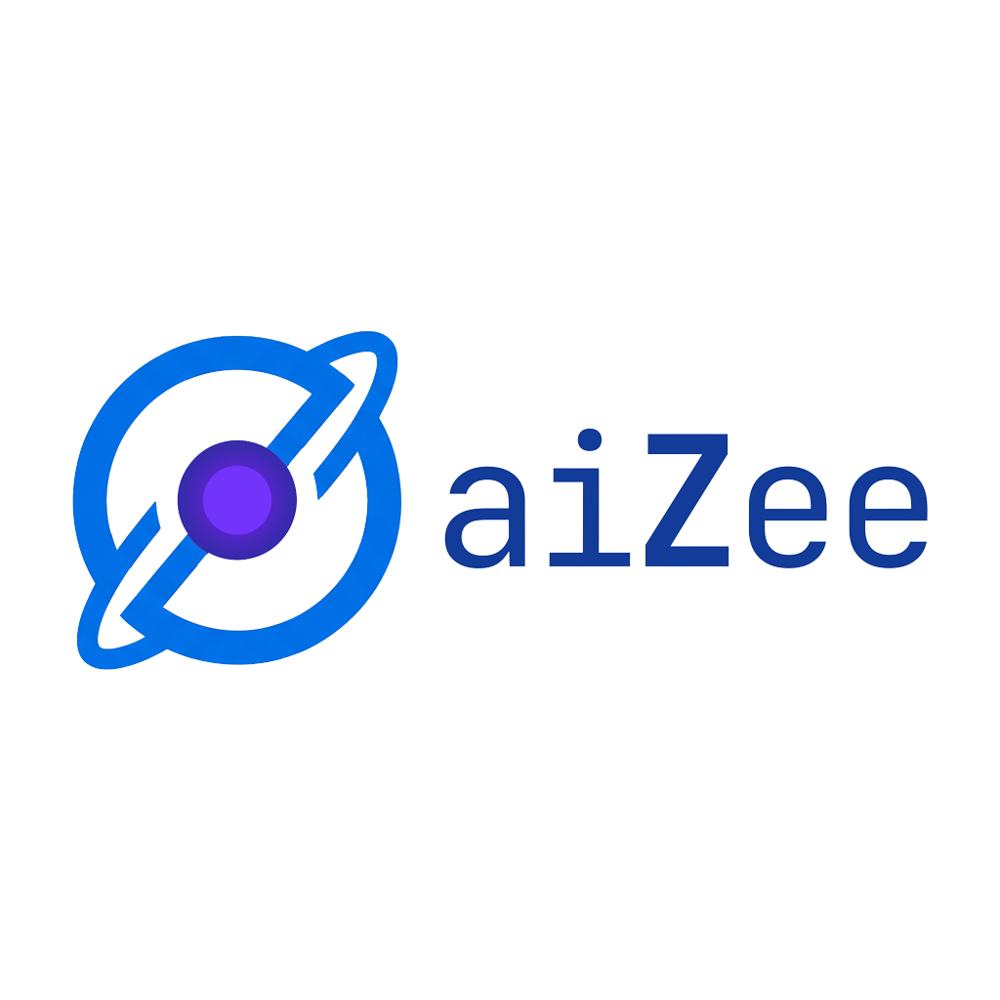

<div align="center">
  
  <h1>aiZee</h1>
  <p><strong>The policy layer for AI coding.</strong></p>

  <p>
    
    
    
    
  </p>
  <p>
    
    
    
    
  </p>
</div>

---

[Read this in Arabic](README-AR.md) · [Changelog](CHANGELOG.md) · [Installer Guide](#installation)

---

## What is aiZee?

A **zero-compromise, version-controlled operating system** that sits between you and every AI coding assistant — Cursor, Claude, Copilot, Windsurf, Cline, Aider, Devin — enforcing engineering standards, security policies, and architectural discipline on every line of generated code.

**The problem it solves:** AI assistants hallucinate APIs, forget conventions, ignore security, and silently ship technical debt. aiZee forces them to read from a centralized source of truth *before* writing a single line — and in v6, every action is verified *while* it executes, not just documented after.

| Without aiZee | With aiZee |
| :--- | :--- |
| Context drift after a few prompts | Rules + personas hard-loaded every session |
| Deprecated packages, silent tech debt | Exact-version tech-stack locked via live MCP docs |
| Raw SQL, missing XSS, weak secrets | OWASP, zero-trust, RBAC enforced by default |
| Random drive-by refactoring | Surgical changes through policy + budget + audit gates |
| Guardrails that exist but aren't on the path | **v6: enforcement wired into `Kernel.act()` + every MCP call** |

---

## What's New in v6.0.0 — Governed Runtime

The headline change: **enforcement is on the execution path**. Guardrail modules that previously existed as standalone, tested-but-unwired units now run inside the action pipeline.

### Enforcement on the action path

- **`runtime/enforcement.py`** — unified helper: MCP firewall → AgentGateway request checks → execution → gateway response checks → audit. Shared by every call path.
- **`Kernel.act()`** — AgentGateway verdicts (ALLOW / REDACT / BLOCK) now gate real actions; prompt-injection and secret-leak checks apply to prompt-like fields without blocking ordinary file writes.
- **Outbound MCP** — `McpClient` (sync + async) and `McpAgent` run the firewall and gateway around every external tool call.
- **Inbound MCP** — the aiZee server's 98 tools keep RBAC *and* get gateway wrapping.

### Detection depth

- **Injection detector L1→L3** — 13-technique regex layer + L2 embedding-similarity layer + optional L3 LLM-judge hook. Deterministic/model-free by default.
- **Dual-LLM hardening** — quarantined worker output is schema-enforced via Pydantic; parse failure is fail-safe.
- **MCP 2026-07-28 stateless** — per-request `protocolVersion` negotiation + `Mcp-Method`/`Mcp-Name` header routing (`runtime/mcp_protocol.py`).

### Governance depth

- **APL verdicts** — policies can now `modify` (rewrite payloads, audited) and `observe` (log-only) in addition to allow/ask/deny.
- **Lifecycle hooks** — `output.pre_send` and `memory.pre_write` phases; hooks can veto or mutate.
- **`aizee heal`** — safe autofix orchestrator (dry-run default, `--apply` with confirmation, audit to `state/heal.log`).
- **Per-PR budgets** — cumulative spend limits keyed by PR id (`AIZEE_PR_ID`), on top of session/hour/day windows.
- **Release gate** — `eval/release_gate.py` runs the reliability priority ladder over recorded rollouts; wired into `aizee ci`.
- **Chaos suite** — `eval/chaos.py` fault-injection scenarios + error-budget math.

### Memory & protocol surfaces

- **Bi-temporal memory** — `store.as_of(as_of=..., valid_at=...)` answers "what did we know then" and "what was true then" separately; `pinned`, soft-delete with tombstone-time queries, contradiction relations.
- **`aizee memory compact`** — `Memory.md` auto-compaction (500-line budget, `[PINNED]` rescue, archive under `memory/archive/`).
- **Code Mode** — `aizee codemode` executes sandboxed Python snippets that call MCP tools directly (AST scan + restricted builtins + governed bridge + timeout).
- **A2A server** — expose aiZee as an A2A peer: `/.well-known/agent-card.json` + JSON-RPC `tasks/send|get|cancel` (loopback + bearer token).
- **`aizee bootstrap`** — materialize a minimal OS root after `pip install aizee` (idempotent, dry-run default).
- **Advisory audits** — `aizee task overcheck` (over-engineering signals from plan + graph), `aizee task curriculum` (staged learning plan from tech-stack refs).

Full detail: [CHANGELOG.md](CHANGELOG.md)

---

## Quick Start

### Prerequisites

| Requirement | Minimum | Recommended |
| :--- | :--- | :--- |
| Python | 3.10 | 3.12 |
| Git | 2.30+ | Latest |
| OS | Windows 10 / macOS 12 / Ubuntu 22.04 | Latest |

### Installation

```bash
git clone https://github.com/m3taz-ahmed/ai-globals.git .ai
cd .ai
```

**Windows — GUI wizard** (double-click `install.bat` or run):
```powershell
.\install.ps1 -Gui
```

**Windows — CLI:**
```powershell
.\install.ps1
```

**macOS / Linux:**
```bash
bash install.sh
```

**PyPI:**
```bash
pip install aizee
aizee bootstrap --target ~/.aizee --yes   # materialize a minimal OS root
export AIZEE_ROOT=~/.aizee
```

### Verify

```bash
aizee doctor    # Health check (46 checks)
aizee heal      # Diagnose + safe autofixes (dry-run; --apply to fix)
aizee status    # Current persona, skills, budget
```

---

## Core Architecture

```
.ai/                         # Sovereign root (discovered via AIZEE_ROOT)
├── AGENTS.md                # Cross-tool canonical bootloader
├── global-roles.md          # 29 personas + operational rules
├── global-workflow.md       # Cognitive loading & execution protocol
├── runtime/                 # Kernel: policy, budget, audit, 142 governance modules
│   ├── kernel.py            # Facade — Probity → Guardian → Policy → Loop → Budget → Audit
│   ├── enforcement.py       # Unified firewall+gateway enforcement helper
│   ├── agent_gateway.py     # Request/response guardrails (ALLOW/REDACT/BLOCK)
│   ├── injection_detector.py# L1 regex + L2 embeddings + L3 LLM-judge
│   ├── codemode/            # Sandboxed code-mode tool execution
│   ├── a2a_server.py        # A2A peer exposure (agent card + tasks)
│   └── policies/            # default/guardian/probity/mcp_firewall YAMLs
├── memory/                  # SQLite + FTS5 + vector, bi-temporal queries
├── aizee_mcp/               # MCP server (98 tools, 3 resources)
├── eval/                    # Benchmarks, chaos, reliability, release gate
├── skills/                  # 139 persona + lord skills
├── workflows/               # 63 trigger-based execution protocols
├── rules/                   # Compressed behavioral rules
├── tech-stack/              # Version-locked stack references
├── dashboard/               # Web dashboard (Python stdlib HTTP)
├── scripts/                 # Installers, validators, MCP wrappers
├── install.ps1 / install.sh # Idempotent OS installer
└── pyproject.toml           # Package metadata + quality config
```

---

## The Six Pillars

### 1. Persona + Skill Composition
29 personas (`ARCH`, `QA`, `SEC`, `DEV`, `SRE`, `DATA`, `ML`, `DEVOPS`, `API`, `FREELANCE`, `MARKETING`, `GROWTH`, `BRAND`, `EMAIL`, `SOCIAL`, `CRO`, `SALES`, etc.) with lord-level domain skills. Auto-detected per task — no manual selection needed.

```bash
aizee persona detect --multi "build a secure docker API with postgres"
# → Primary: ARCH + Secondary: SEC, DEVOPS + Lords: security-lord, cloud-platforms-lord
```

### 2. Runtime Governance
Every action passes through the gate pipeline before execution:

```
Probity → Guardian → Policy → Loop Detector → Budget → Audit
        └─ AgentGateway: injection + secret-leak verdicts (v6)
```

- **Policy engine** — `allow/ask/deny/modify/observe` YAML rules with AST-safe evaluation
- **MCP firewall** — rule-based outbound tool-call gate (deny destructive, ask unknown)
- **AgentGateway** — prompt/response guardrails on every enforced path
- **Budget manager** — token/cost/call limits per session/hour/day/week/month **and per PR**
- **Audit logger** — SHA-256 hash-chained, Ed25519-signed, tamper-evident trail
- **Workflow runner** — durable SQLite-backed execution with saga compensation

### 3. Live Ground-Truth
Context7 MCP fetches current library docs before implementation. Graphify knowledge graph replaces blind `grep` for codebase navigation.

### 4. Hybrid Memory
SQLite + FTS5 full-text + optional vector index (SentenceTransformers). Episodic, semantic, factual, procedural layers — now with pinning, soft-delete, contradiction links, HMAC integrity, and bi-temporal `as_of` queries.

```bash
aizee memory ingest                # Rebuild index after changes
aizee memory search "docker"       # Full-text + vector search
aizee memory compact               # Keep Memory.md under its line budget
```

### 5. Quality Gates (Zero Defect)
```bash
ruff check .                 # 0 warnings
mypy                         # Strict typing
aizee test --full            # full suite + coverage (fail-under=100)
python eval/harness.py       # E2E eval: ruff + mypy + pytest + validate-globals
```

### 6. Token Efficiency
Persona detection is local (pure Python, zero LLM tokens). Code Mode replaces tool-call JSON ping-pong with sandboxed snippets that invoke tools directly — materially fewer orchestration tokens on multi-tool tasks.

---

## Runtime Enforcement Map

| Path | Gates applied |
| :--- | :--- |
| `Kernel.act()` | Probity → Guardian → Policy → Loop → Budget → Audit + AgentGateway prompt checks |
| Outbound MCP (`McpClient`, `McpAgent`, `aizee mcp call`) | mcp_firewall → gateway request → execute → gateway response |
| Inbound MCP (`aizee_mcp` tools) | RBAC + gateway request/response wrap |
| Chat (`kernel.chat_message`) | prompt_gate → … → `output.pre_send` hooks |
| Memory writes | `memory.pre_write` hooks (veto/mutate) + HMAC integrity |
| Code Mode (`aizee codemode`) | AST sandbox scan + restricted builtins + governed `call_tool` |
| A2A tasks | Bearer auth + governed task handler |

---

## Dashboard

```bash
python dashboard/server.py 8080
# → http://127.0.0.1:8080
```

Dark-first command-center UI: command palette (`Ctrl+K`), bento-grid metrics, status pills, glass panels. Optional Bearer auth via `AIZEE_DASHBOARD_TOKEN`.

**Tabs:** Overview · Memory Explorer · Policy Sandbox · Workflows · Sagas · Chat · Tech Stack · Telemetry · System Health · Audit Logs · **Settings**

> **Important — disable MCP servers you don't use.** Every enabled MCP server consumes memory and may spawn a subprocess on first tool call. After installation, open **Settings → MCP Servers**, uncheck what you don't need (**Uncheck All** then re-check), and **Save Changes**. The kernel auto-reloads on save.

Settings persist to `state/settings.json` (gitignored, survives updates). Schema migrations run automatically — old files are backed up.

---

## Key Commands

| Command | Purpose |
| :--- | :--- |
| `aizee doctor` | Environment health (46 checks) |
| `aizee heal [--apply] [-y]` | Diagnose + safe auto-fixes (dry-run default) |
| `aizee check <action>` | Policy verdict for an action |
| `aizee memory compact [--apply]` | Compact Memory.md to its line budget |
| `aizee codemode --code/--file` | Sandboxed snippet calling MCP tools |
| `aizee task overcheck` | Over-engineering audit of the active plan |
| `aizee task curriculum --stack …` | Staged learning plan from tech-stack refs |
| `aizee bootstrap --target DIR` | Materialize an OS root (post-`pip install`) |
| `aizee ci` | Full CI gates incl. reliability release gate |
| `aizee security scan <path>` | SAST + external scanner orchestration |

---

## Quality Gates

| Gate | Command | Status |
| :--- | :--- | :--- |
| Lint | `ruff check .` | 0 warnings |
| Types | `mypy` | 0 errors (strict) |
| Tests (fast) | `aizee test` | fast tier, no coverage |
| Tests (full) | `aizee test --full` | full suite, coverage floor 100% |
| Integrity | `scripts/validate-globals.py` | 539 files, 0 errors |
| Docs sync | `scripts/sync_docs.py --check` | in sync |
| E2E | `python eval/harness.py` | all gates pass |
| Release | `python eval/release_gate.py` | reliability ladder over rollout evidence |

---

## Tech Stack

- **Core:** Pure Python 3.10+ (no Node.js required for core OS)
- **Memory:** SQLite + FTS5 + optional SentenceTransformers vectors
- **MCP:** FastMCP server with 98 tools
- **Dashboard:** Python stdlib HTTP server + SQLite
- **Knowledge graph:** graphify (optional)
- **Dependencies:** pyyaml, pydantic, rich, cryptography, numpy, turbovec

---

## Contributing

1. Fork → feature branch (`feature/*`)
2. Write tests first (AAA pattern, one behavior per test)
3. Run `ruff check . && mypy && pytest -q && python eval/harness.py`
4. All gates must pass — no PR without green
5. Conventional commits: `type(scope): subject`
6. PR ≤ 400 lines, targeted tests only

---

## License

MIT — see [LICENSE](LICENSE).

---

<div align="center">
  <p><strong>aiZee</strong> — The policy layer for AI coding.</p>
  <p>Built by <a href="https://linkedin.com/in/moataz-ahmed">Moataz Ahmed</a></p>
</div>
