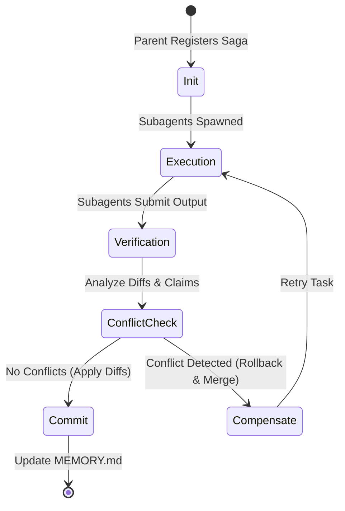

# Phase 10: Multi-Agent Saga Reconciliation Protocol

> [!IMPORTANT]
> This protocol is triggered when delegating tasks to parallel subagents or when reconciling concurrent agent state modifications.
> **SCOPE:** MULTI-AGENT STATE RESILIENCE AND CONFLICT RESOLUTION.

## 1. THE CONCURRENCY PROBLEM
When multiple autonomous subagents operate in parallel on the same workspace, they run the risk of:
- **State Fragmentation:** Subagents making contradictory architectural assumptions.
- **Race Conditions:** Overwriting each other's file modifications.
- **Goal Drift:** Diverging from the master execution plan because of localized decision-making.

To prevent this, all inter-agent operations MUST follow the Saga Pattern with explicit verification handshakes.

## 2. METADATA & TRACING HEADERS
Every subagent session or delegated task must carry tracing metadata in its execution context:
*   `X-Saga-ID`: A unique UUIDv4 identifying the global execution transaction.
*   `X-Parent-Span`: The context ID of the originating agent.
*   `X-Agent-Persona`: The active role/persona of the subagent (e.g., `analyst`, `refactor`).

## 3. THE SAGA LIFECYCLE

### 3.1 Step 1: Initialization (Registration)
*   The parent agent registers a Saga ID and writes a master checklist in the parent context.
*   Define the exact boundary directories and files allocated to each subagent. **Subagents must not write outside their assigned scope.**

### 3.2 Step 2: Parallel Execution
*   Subagents execute tasks within their sandbox boundaries.
*   All temporary results and modifications are recorded in local session files inside the session's workspace.

### 3.3 Step 3: Reconciliation & Verification
Upon subagent completion, the parent agent runs a verification handshake:
1.  **State Schema Check:** Verify the output conforms to expected schema.
2.  **Diff Scan:** Check all modified files against the baseline to ensure no out-of-scope edits were made.
3.  **Conflict Scan:** Check if any two subagents edited the same file or modified overlapping functions.

### 3.4 Step 4: Conflict Resolution Matrix
If a conflict is detected, apply the following resolution matrix:

| Conflict Type | Primary Cause | Resolution Action |
|---|---|---|
| Overlapping File Diffs | Concurrent writes to same file | Reject secondary diff. Perform a three-way git merge or sequentially execute tasks. |
| Configuration Drift | Changes to shared configs (e.g. `.env`) | Parent agent acts as central broker, merges variables, and redelegates. |
| Architectural Contradiction | Conflicting class structures or API signatures | Halt execution. Parent rolls back changes, clarifies the API contract, and restarts the task. |

### 3.5 Step 5: Compensation & Commits
*   If checks pass: The parent agent merges the changes, updates `MEMORY.md`, and tags the Git commit with the Saga ID (e.g., `feat: resolve payment gateway [Saga-ID]`).
*   If checks fail: Trigger compensation actions. Roll back the workspace state using `git checkout` or `git reset` on the affected paths, isolate the failing agent, and execute the task sequentially.

---

## 🤝 RECONCILIATION CHECKLIST (Mandatory)
- [ ] **Saga ID:** Is the unique `X-Saga-ID` present in the session metadata?
- [ ] **Scope Guard:** Have I verified that no subagent modified files outside its assigned boundary?
- [ ] **Diff Analysis:** Have all concurrent file diffs been scanned for overlap?
- [ ] **Verification Handshake:** Have all success criteria been checked before committing the Saga?
